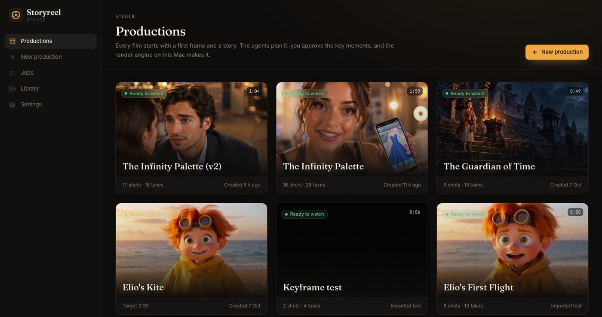
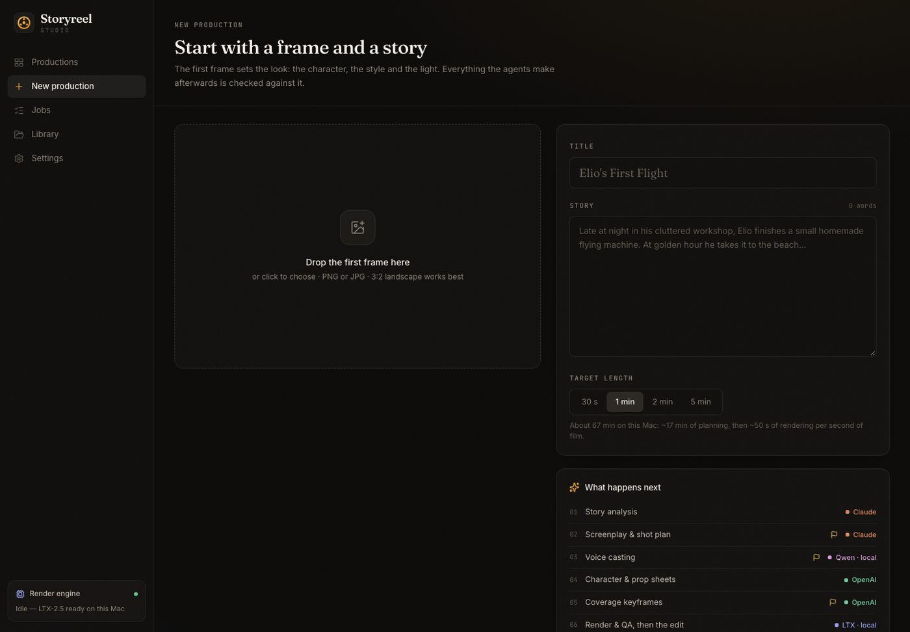
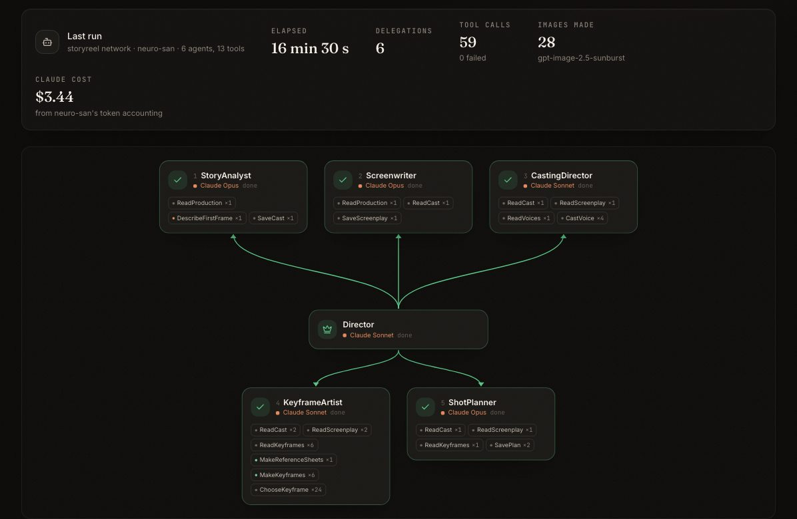
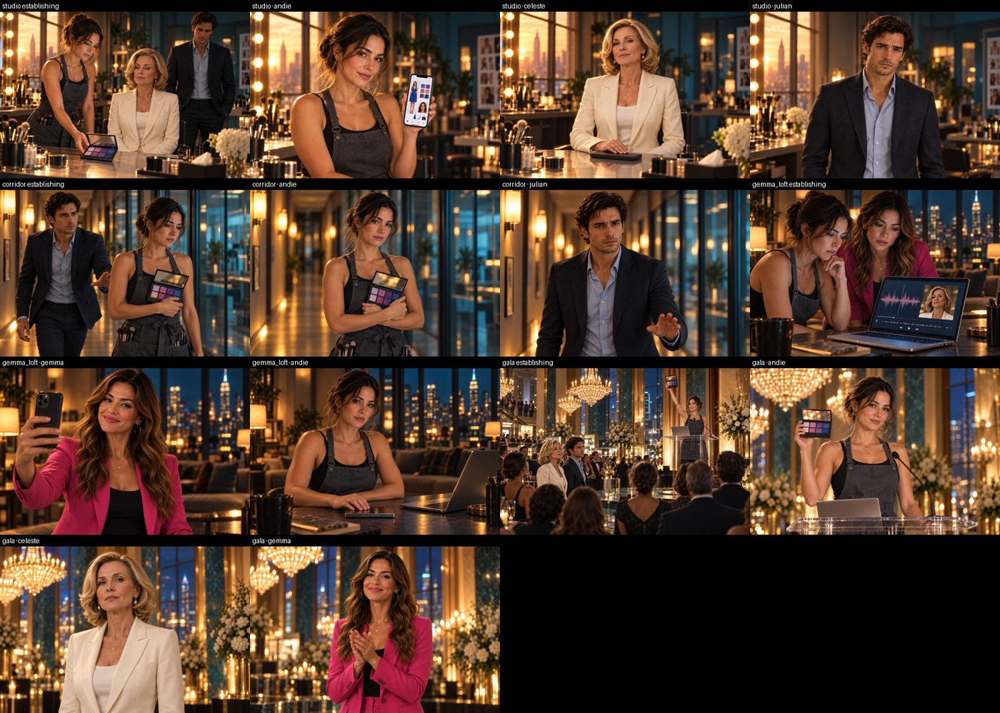
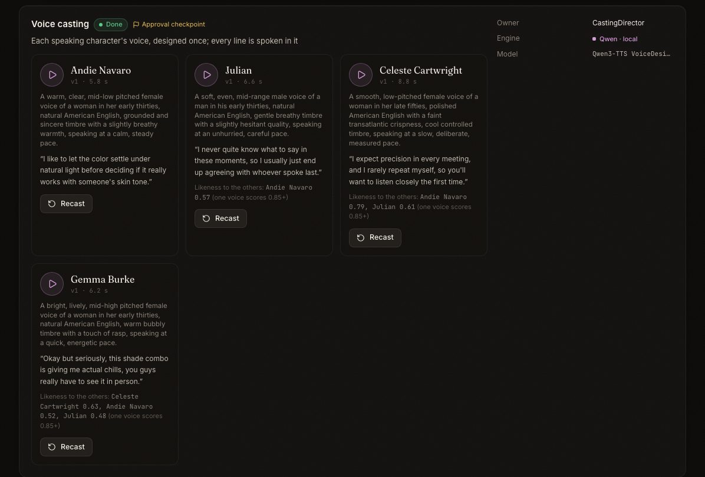
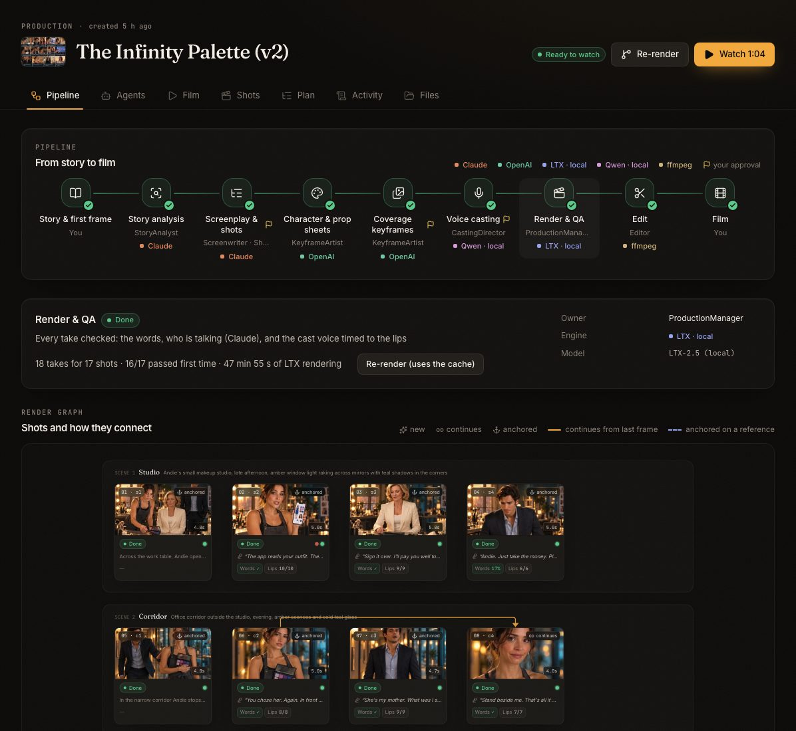
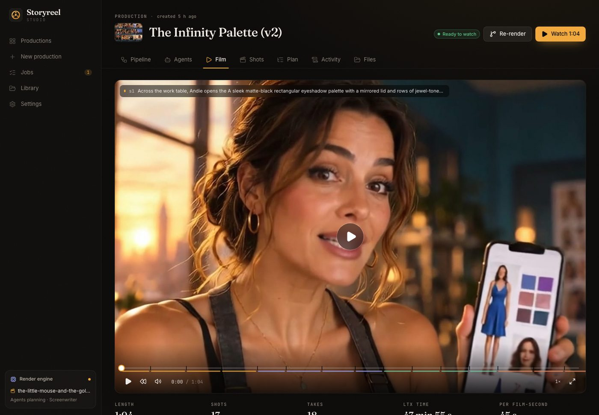
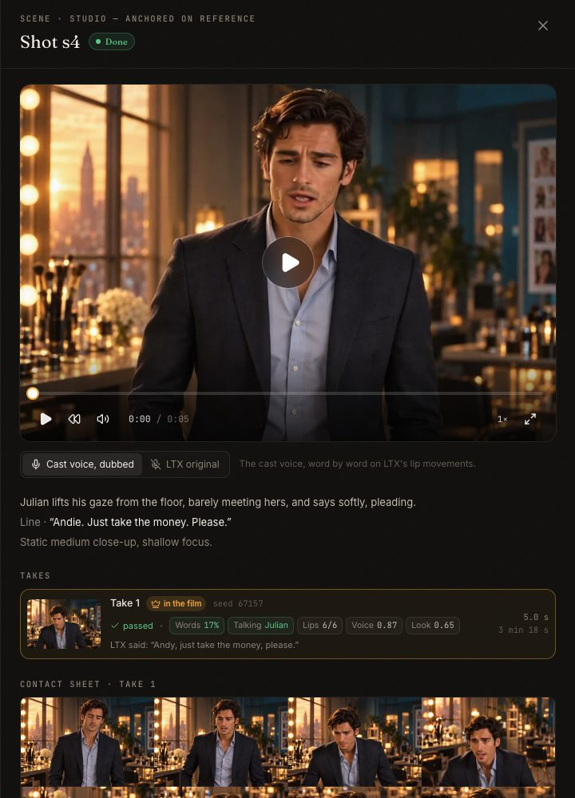

# Storyreel Studio

Make a short film from **one picture and a story**, on your Mac.



## What it does

1. You give it a **first frame** (one picture) and a **short story**.
2. AI agents **plan the film**: the characters, the screenplay, a voice for every character, a picture for every shot, and the shot list.
3. You **check and approve** the plan, the pictures and the voices.
4. Your Mac **makes the video** with LTX-2.5, checks every shot, redoes the bad ones, and edits the film.

The studio checks every shot: each character keeps the same voice everywhere, and the person on screen is the one speaking.

## What you need

- A Mac with Apple Silicon (M1 or newer). **64 GB of memory** is best.
- About **100 GB of free disk space**.
- An **Anthropic API key** (Claude) and an **OpenAI API key**.
- A free **Hugging Face** account.

## Setup (one time)

### Step 1. Install the tools

If you don't have [Homebrew](https://brew.sh) yet, install it first. Then:

```bash
brew install uv node ffmpeg git
```

### Step 2. Get the code

```bash
git clone https://github.com/souravJBcognizant/storyreel-studio.git
cd storyreel-studio
```

### Step 3. Install the app

```bash
uv sync
cd web && npm install && cd ..
```

### Step 4. Install the video engine (LTX)

```bash
git clone https://github.com/dgrauet/ltx-2-mlx.git ltx-2-mlx
cd ltx-2-mlx && git checkout bfa5755 && uv sync --all-extras && cd ..
```

### Step 5. Download the video model (about 70 GB)

1. Open [huggingface.co/dgrauet/ltx-2.5-mlx-q8](https://huggingface.co/dgrauet/ltx-2.5-mlx-q8) and accept the license.
2. Make a token at [huggingface.co/settings/tokens](https://huggingface.co/settings/tokens), then log in:
   ```bash
   uv run hf auth login
   ```
3. Download the model. This takes 30 to 60 minutes:
   ```bash
   scripts/fetch_ltx.sh
   ```
   You can follow the progress in `models/download-ltx.log`.

### Step 6. Add your API keys

```bash
cp .env.example .env
open -e .env
```

Paste your keys after `ANTHROPIC_API_KEY=` and `OPENAI_API_KEY=`, then save the file.
The `.env` file stays on your Mac. It is never uploaded to GitHub.

### Step 7. Start the studio

```bash
scripts/dev.sh
```

Open **http://localhost:5288** in your browser. Press `Ctrl+C` in the terminal to stop it.

The first film downloads a few smaller models by itself (speech and voice, about 10 GB).

## Make your first film

**1. Start a new production.** Add a picture, a title and a story, and pick a length.



**2. Click "Plan with agents".** This takes about 15 minutes. Open the **Agents** tab to watch them work.



**3. Check the pictures.** Every scene gets one wide picture, plus a close-up of each person who speaks in it.



**4. Listen to the voices.** Press play on each card. If a voice doesn't fit, click **Recast** and describe the voice you want. When you are happy, approve the plan, the pictures and the voices.



**5. Click "Render film".** Your Mac needs about 50 seconds for each second of film, so a 1-minute film takes about an hour. You can close the page; the render keeps going and keeps the Mac awake.



**6. Watch your film** in the **Film** tab.



Click any shot to see its takes and the checks it passed. You can switch between the character's voice and LTX's original sound.



## How it works

| Step | Done by | Runs on |
|---|---|---|
| Story, screenplay, shot list | Claude agents (neuro-san) | Claude API |
| A voice for every character | Qwen3-TTS | your Mac |
| Character sheets and keyframes | OpenAI images, checked by Claude | OpenAI API |
| Video | LTX-2.5 | your Mac |
| Checks: the words, who is talking | Whisper and Claude | your Mac and Claude API |
| Edit and sound | ffmpeg | your Mac |

## If something goes wrong

- **The model download says 403:** you have not accepted the license yet (Step 5.1).
- **The Settings page says a key is missing:** check `.env`, then stop and start the studio again.
- **A shot says "needs review":** the best take is still used in the film. Open the shot to see which check it failed and why.
- **A render stopped half way:** click **Render film** (or **Re-render**) again. Shots that are already made are reused, so it carries on where it stopped.

## Folders

| Folder | What is inside |
|---|---|
| `storyvid/` | The engine: render, checks, voices, edit, and the web API |
| `agents/` | The agent network (neuro-san) and its tools |
| `web/` | The studio app (React) |
| `productions/` | Your films. Made by the app, never uploaded |
| `stage0/` to `stage3/` | The tests that shaped the design |

## License note

The LTX-2.x model has its own license. Companies with $10M or more in yearly revenue may use it for free **only for non-commercial testing**. Using it in a product needs a paid license from Lightricks. Videos you share must say they were made by AI; every film from this studio has that note in its file.
